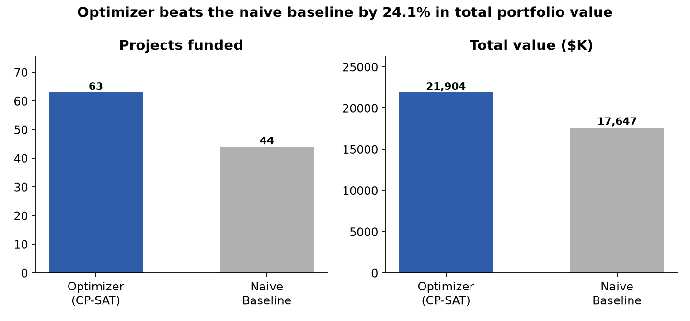
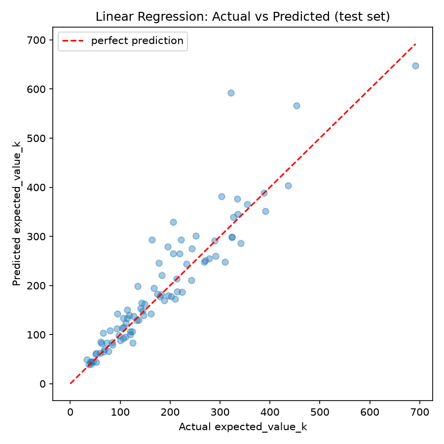
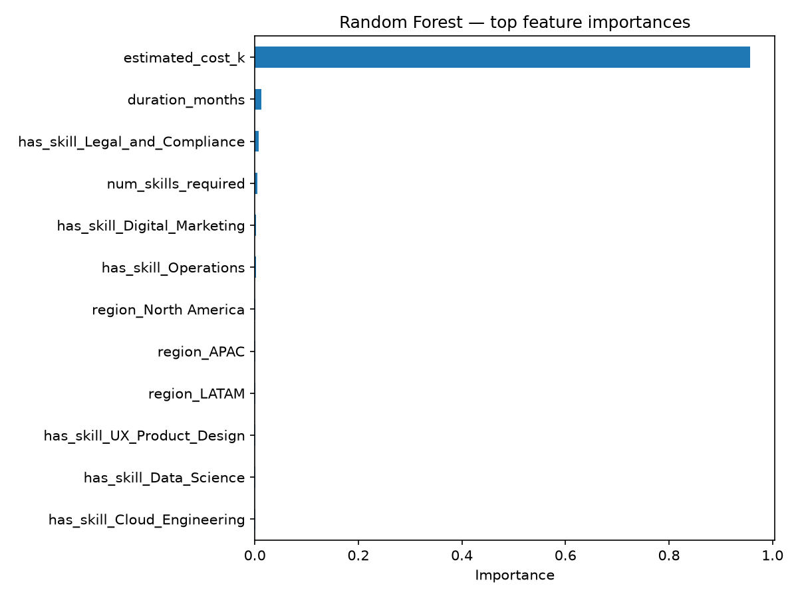
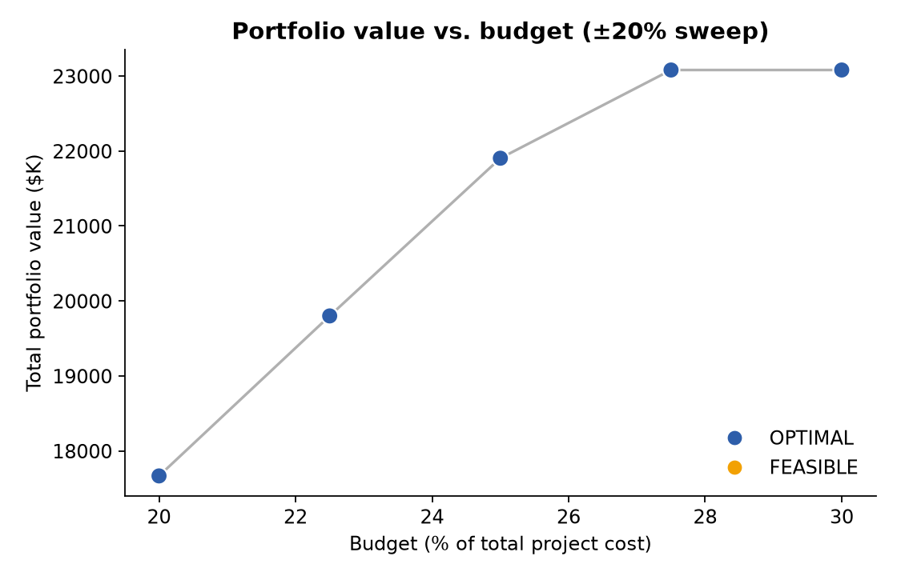
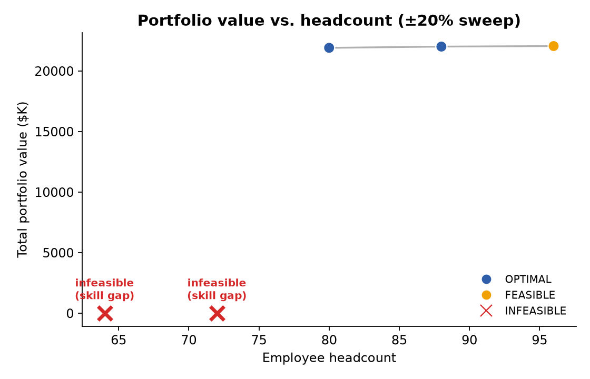
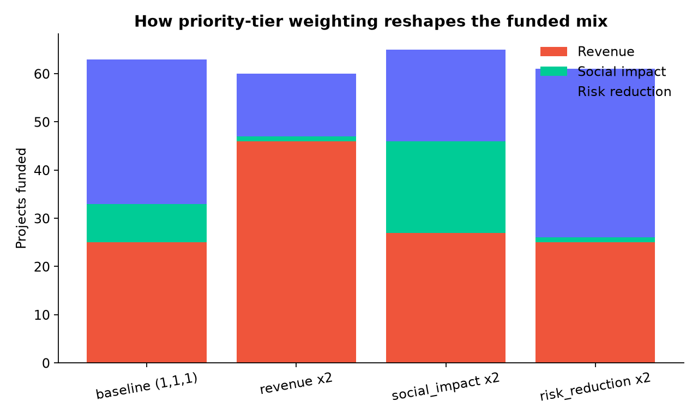

# 🎯 Intelligent Resource Allocation & Scenario Optimization Platform

**Which projects should we fund, and who should work on them?** A constrained
optimization system that answers that jointly — under budget, headcount,
skill, and regional constraints — with a predictive expected-value layer and
a live what-if simulator.


---

## 📌 Results at a glance

<p align="center">
  
</p>

A joint CP-SAT optimization over **which projects to fund** and **which
employee covers which required skill** beats a naive "fund the
highest-value projects first" heuristic by roughly **20% in total portfolio
value** — while the naive approach also silently violates a regional-minimum
business rule the optimizer respects by construction.

---

## 🧩 Problem framing

Given N candidate projects and a fixed pool of M employees, decide:
1. **Which projects get funded** — subject to a money budget and a set of
   non-negotiable "must-fund" compliance/strategic projects.
2. **Which employee gets staffed on which project** — subject to each
   employee working on at most one project, and every skill a project
   requires being covered by someone actually assigned to it.
3. **How this changes** as budget, headcount, or leadership's priorities
   shift — via a live simulator, not a static spreadsheet.

## 🧪 Why the data is legitimate, not arbitrary noise

All data is synthetic (standard practice for optimization portfolio
projects — real internal allocation data is never public), but it's
**calibrated against a real reference dataset**: the CAPM dataset
(`Ecdat::Capm` on [Rdatasets](https://github.com/vincentarelbundock/Rdatasets)) —
516 months of real historical industry-portfolio stock returns.

| CAPM industry | Annualized return / volatility | Maps to priority tier | Why |
|---|:---:|---|---|
| Durables (`rdur`) | 6.3% / **20.1%** (widest) | `revenue` | Growth bets — highest upside, highest risk |
| Consumables (`rcon`) | 5.1% / 20.1% | `social_impact` | Moderate, harder to predict |
| Food staples (`rfood`) | 8.0% / **15.7%** (tightest) | `risk_reduction` | Defensive, stable, predictable value |

This gives a real, citable reason why revenue-tier projects have the widest
expected-value spread — instead of a hand-tuned choice. Cost, skill
requirements, and employee pricing are also deliberately correlated (by
tier, region, and skill scarcity) rather than independently random.

---

## 🏗️ Architecture

```
Synthetic project/employee data (calibrated against real CAPM returns)
        │
        ▼
Predictive layer  ──  Linear Regression  vs.  Random Forest
        │             predicts expected_value_k from project attributes only
        ▼             (cost, tier, region, skills, duration — never ROI/value-std,
                       which would leak the answer)
CP-SAT optimization model (OR-Tools)
        │             decision vars : fund[project], assign[employee, project]
        │             objective     : maximize total predicted value
        ▼             constraints   : budget · headcount · skill coverage ·
                                       regional minimums · must-fund mandates
Optimal allocation  ──vs.──  naive "highest-value-first" baseline
        │
        ▼
Streamlit what-if simulator (sliders re-trigger the solver live)
```

<details>
<summary><b>Key modeling decisions (click to expand)</b></summary>

- **CP-SAT, not a pure LP** — the problem is a combined **assignment
  problem** (which employee → which project) and **knapsack problem**
  (which projects to fund), both needing integer/boolean variables CP-SAT
  models naturally.
- **Budget and headcount are two separate constrained resources**, not one
  merged pool — mirroring real portfolio management: capped by cash *and*
  by people, tied together by skills.
- **1:1 staffing**: each employee assigned to at most one project.
- **Strict skill-matching**: a project can only be funded if every required
  skill is covered by an assigned employee — this is what usually makes
  **headcount**, not budget, the binding constraint.
- **The optimizer maximizes *predicted* value, not true value** — a real
  system never knows a project's true future value in advance.

</details>

---

## 📁 Repository structure

```
resource-allocation-optimizer/
├── data/
│   ├── raw/capm_reference.csv           # real reference data (cached)
│   └── processed/                        # generated + derived datasets
├── src/
│   ├── generate_data.py                  # Step 1 — synthetic data generator
│   ├── predict_value.py                  # Step 2 — predictive layer
│   ├── optimize.py                       # Step 3 — CP-SAT optimizer + baseline
│   ├── sensitivity.py                    # Step 4 — sensitivity sweeps
│   └── make_readme_assets.py             # regenerates the charts below
├── app/streamlit_app.py                  # Step 5 — live what-if simulator
├── models/best_model.joblib              # trained predictive model
├── reports/                               # full-res plots + interactive HTML
├── assets/                                # README images
├── requirements.txt
└── README.md
```

## 🚀 Setup & running the pipeline

```bash
python -m venv .venv
.venv\Scripts\activate        # Windows
# source .venv/bin/activate   # macOS/Linux
pip install -r requirements.txt
```

Run in order — each step reads the previous step's output from `data/processed/`:

```bash
python src/generate_data.py         # -> projects.csv, employees.csv
python src/predict_value.py         # -> projects_with_predictions.csv, models/best_model.joblib
python src/optimize.py              # -> allocation_result.csv (prints optimizer vs. baseline)
python src/sensitivity.py           # -> sensitivity_*.csv + reports/*.html
python src/make_readme_assets.py    # -> assets/*.png (regenerates the charts in this README)
streamlit run app/streamlit_app.py  # live simulator in the browser
```

`optimize.py` takes flags for experimentation, e.g.:
```bash
python src/optimize.py --budget_fraction 0.3 --min_projects_per_region 5 --time_limit 60
```

---

## 📊 Results

### Predictive layer: Linear Regression beat Random Forest

| Model | R² (test) | MAE ($K) | RMSE ($K) |
|---|:---:|:---:|:---:|
| **Linear Regression** | **0.837** | 28.4 | 46.4 |
| Random Forest | 0.790 | 30.8 | 52.6 |

Not a bug — the true value-generating process is close to linear
(`value ≈ cost × (1 + tier's average ROI)`), so Random Forest's extra
flexibility added variance without benefit. Knowing when *not* to reach for
the fancier model is the point.

<p align="center">
  
  
</p>

Cost dominates feature importance (>90%) because its absolute range
($20K–$700K+) swamps the few-percentage-point ROI difference between tiers —
predicting ROI% instead of absolute value would surface tier effects more
clearly.

### Sensitivity analysis: what actually moves the needle

<p align="center">
  
  
</p>

- **Budget** shows classic diminishing returns, plateauing once headcount
  (not money) becomes the binding constraint.
- **Headcount** below ~90% of baseline can make the problem **infeasible**,
  not just worse — a must-fund compliance project can lose its only
  available skill match entirely. That's a sharper, more useful finding than
  a smooth curve: it flags a real hiring-gap risk.

<p align="center">
  
</p>

Doubling the weight on one priority tier visibly reshapes *which* projects
get funded without moving total raw value much — a clean trade-off dial for
the live simulator.

---

## ⚠️ Honest caveats

- CP-SAT often returns `FEASIBLE`, not `OPTIMAL`, within the time limits
  used for interactive/sweep speed — results can vary slightly run-to-run.
  Use a longer `--time_limit` for a final, more certain report.
- Employee counts above the generated 80 (in the sensitivity sweep and the
  simulator) are simulated by bootstrap-resampling existing employees'
  skill/cost profiles — an approximation for "hired more people like the
  ones we have," not literal new hires.
- All underlying data is synthetic; the CAPM calibration justifies the
  *shape* of the value distributions, not the literal dollar figures.


---

**Tech stack:** Python · pandas · scikit-learn · OR-Tools (CP-SAT) · Streamlit · Plotly
